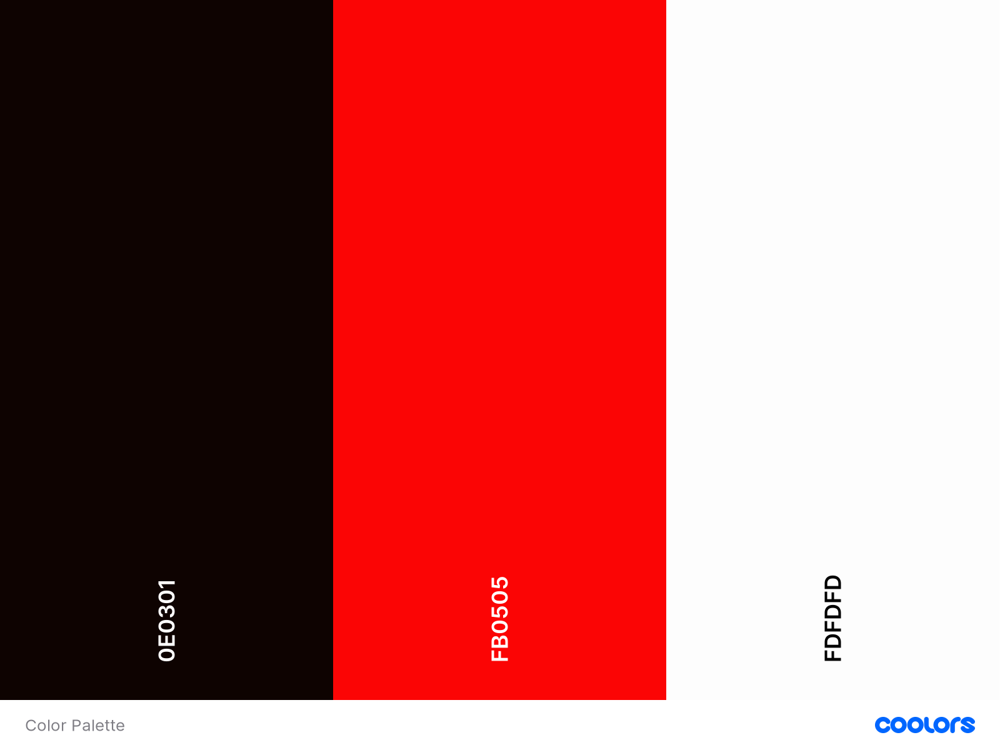

# Jon Jones

Live Site https://izzysoprano.github.io/Jon-Jones/

## Contents ##

- Objective
- User-Stories
- User Experience
- Testing
- Deployment
- Credits

## Objective

The purpose of this project is to create a website for **UFC fighter Jon Jones**. It will allow users to purchase apparel, view his UFC fights through video content, keep up to date with current Jon Jones news and have links to his social media.

## User Stories

- A user should be able to know who Jon Jones is and understand his background and know his profession
- A user should be to get in touch with the support team regarding any order issues
- A user should be able to view Jones' fighting record 
- A user should have access to Jones' social links
- The user should have access to the latest Jon Jones news
- The user should be able to access media content on all devices 

# User Experience (UX)
## 1. Strategy
- A simple and easy to use UX that allows users to navigate through the different webpages with ease

## Project Goals
- Allow users to purchase Jon Jones merchandise and apparel
- Allow users to get in touch with order issues
- Allow users to view media content through images and video 
- Create a reponsive website that is accessible across dektop, tablet and mobile.

## Customer Goals
- Mobile first
- Provide a Contact page to allow users to get in touch with order issues
- Include Social links to JJ social acocunts
- Provide a consistent theme
 

## 2. Scope 
- A simple to use navigation that has a consistent theme in all webpages
- Display correct media content in an organised manner throughout
- Have each webpage very simple and easy to the eye with design 

## 3. Structure
- Provide the right amount of media content in the right areas to serve the purpose of the webpage 
- Have a consistent navigation menu throughout all webpages

## 4. Skeleton
- [Wireframes]()
- Set a fixed navigation menu
- Have a **Home, Shop, UFC and Contact page**
- Footer section that has links to Jon Jone's social accounts

## 5. Surface

### Design

#### Colours
- Have a black/red/white theme that resembles the UFC and depicts Jon Jones the fighter

#### Typography

**Oswald font family**
- Header:
- Body:

#### Images
- Display an even amount of images that correlates with the overall theme.

### Wireframe
-Balsamiq

### Features

- Footer section that includes Social links
- Video and images content 

### Features that will added in the future:

- ecommerce
- Animations 

### Technologies 

#### Languages 
- HTML
- CSS 

### Frameworks and Libraries used 
- Git
- Bootstrap
- Font-Awesome
- Google fonts

|-----------------------------------------------------------------------------|

### Testing

### Issues Faced

- Wasn't familiar with Git and how to commit at first, but after reaching out to the Slack community, I've come to understand it and how it works.
- Have trouble understanding how to section content using the Bootstrap Grid System
- Added a CSS Animation section to my UFC page, however, it's not fully embedded and responsive.
- After my first initial deployment, the links were'nt working responsibly 
- As I'd like two carousels, my buttons for the second carosuel aren't responding. I've tried changing the id but still won't repsond 

#Bugs

- My second carousel buttons aren't responding correctly

### What I did to fix them

- Changed id 

### Deployment

GitHub Pages

### Credits

## Photos

Carousel 
- https://www.mmafighting.com/
-https://www.mmafighting.com/2015/1/3/7487711/ufc-182-photos#ufc-182-photos

Logo
-https://www.teepublic.com/pin/7526557-jon-bones-jones

Info
UFC Foght record
-http://ufcstats.com/fighter-details/07f72a2a7591b409

Mentor
Slack community