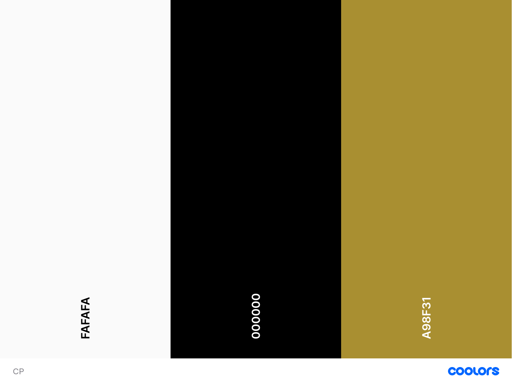

# Jon Jones

https://izzysoprano.github.io/Jon-Jones/

## Contents ##

- Objective
- User-Stories
- User Experience
- Testing
- Deployment
- Credits

## Objective

The purpose of this project is to create a fan website for **UFC fighter Jon Jones**. It will allow users to view his fighting record, view apperal, subscribe to a newsletter, be able to get in touch with the support team and have links to his social accounts.

## User Stories

- A user should be able to know who Jon Jones is and understand his background and know his profession
- A user should be to get in touch with the support team via a form regarding any order issues
- A user should be able to view Jones' fighting record 
- A user should have access to Jones' social links
- The user should be able to access video content on all devices 
- The user shouls be able to subscribe to a newsletter

# User Experience (UX)
## 1. Strategy
- A simple and easy to use UX that allows users to navigate through the different webpages with ease

## Project Goals
- Allow users to get in touch via a form
- Allow users to view media content through images and video 
- Subscribe to a newsletter via email
- Create a reponsive website that is accessible across desktop, tablet and mobile.

## Customer Goals
- Mobile first
- Provide a Contact page to allow users to get in touch with order issues
- Include Social links to Jon Jones social accounts

## 2. Scope 
- A simple to use navigation that has a consistent theme in all webpages
- Display correct media content in an organised manner throughout
- Have each webpage very simple and easy to the eye with design 

## 3. Structure
- Provide the right amount of media content in the right areas to serve the purpose of the webpage 
- Have a consistent navigation menu throughout all webpages

## 4. Skeleton
- Set a navigation menu using Bootstrap
- Have a **Home, Shop and Contact page**
- Footer section that has links to Jon Jones social accounts
- The tick icon in the Newsletter footer section will not be a responsive link
- The 'Add to Cart' and 'Details' buttons in the shop menu will not be responsive links

## 5. Surface

### Design

#### Colours
- Black/white/gold theme

### Typography

- **Lato font family** (Google Fonts)
- **Homemade Apple** (Google Fonts) - will be used for the signature in the index page
- **Apple System**

### Images
- The index page will have a drawing of Jon Jones as the face of the page to in order to set the tone of the overall site
- The UFC Fight record table will have a background image of Jon Jones holding UFC belt to emphasize his champion status

### Shop page
- Screesnhots of the shop products from the UFC store will be used to display the apperal 

# Wireframe

# Features

- Footer section that includes Social links
- Video and images content 
- Newsletter within the Footer

# Features that will added in the future:

- Animations

# Languages 

1. HTML 
2. CSS

# Frameworks & Libaries Used 

1. [Git](https://git-scm.com/)
* Version control

2. [Github](https://github.com/)
* Used for storing and deploying the site

3. [GitPod](https://www.gitpod.io/)
* Used for writing out code

4. [Bootstrap v4.6.0](https://getbootstrap.com/)
* Used for layout and structure

5. [Font-Awesome](https://fontawesome.com/)
* Used for styling 

6. [Google fonts](https://fonts.google.com/)
* Used for site text

7. [Dev Tools](https://developer.chrome.com/docs/devtools/)
* Used to test responsiveness, test the changes before changing code

8. [Coolers](https://coolors.co/)
* Used to display site's theme

# Testing

# Challenges

Git 
- Wasn't familiar with Git, didn't know what and how to use source control and how to commit at first, but after reaching out to the Slack community, I've come to understand it and how it works.
- After my first initial deployment, the site link wasn't working responsibly. After refreshing several times, link was deployed successfully

Footer 
- Sectioning my footer into 3 sections at the start was difficult as I couldn't understand CSS/BS Grid. I decided to reach out to the slack community and throughly watch video tutoriols on CSS grid. After having a play around, I managed to understand it and intergrate it in my site
- The social icons weren't appearing as it was within a div. Removed my div and solved the problem 

CSS/Bootstrap
- The table on index page wasn't responsive due to added padding. I removed the padding which solved the problem, the table is now responsive

# Bugs

- My images weren't being displyed in my README. I needed to add a correct typo in my [] to solve this problem

# Deployment

- This repo was deployed through GitHub pages. I did this by:

1. Logged on to github and opened my repository Log in GitHub and open the repository
2. From here clicked settings, see picture below.

3. In settings scrolled down to Github pages, here under source branch I selected Master and kept the default root and then clicked save.

4. The page is now published and the site address is available in the github page section.

# Credits

### Photos

1.Logo
https://www.teepublic.com/pin/9736373-jon-bones-jones

2.Drawing
https://www.artstation.com/artwork/VgdGdP

3.Shop Images
https://ufcstore.eu/collections/jon-jones

### Text

UFC Fight record
http://ufcstats.com/fighter-details/07f72a2a7591b409

### Tutoriols/links

OS Training - [Responsive Videos](https://www.ostraining.com/blog/coding/responsive-videos/)

Brian Design - [CSS Button Hover Animation Effects using Only HTML & CSS](https://www.youtube.com/watch?v=zPcvAwp71uA)

Dani Krossing - [Tables In HTML and CSS | How To Create Tables | Learn HTML and CSS | HTML Tutorial | CSS Tutorial](https://www.youtube.com/watch?v=dK27jWKtJxs)

A massive thanks to both John and Jim for helping me get through my first project
* 
[John Traas](https://github.com/Jays-T)

[Jim Lynx](https://github.com/JimLynx)

Mentor - Narender Singh

Slack community